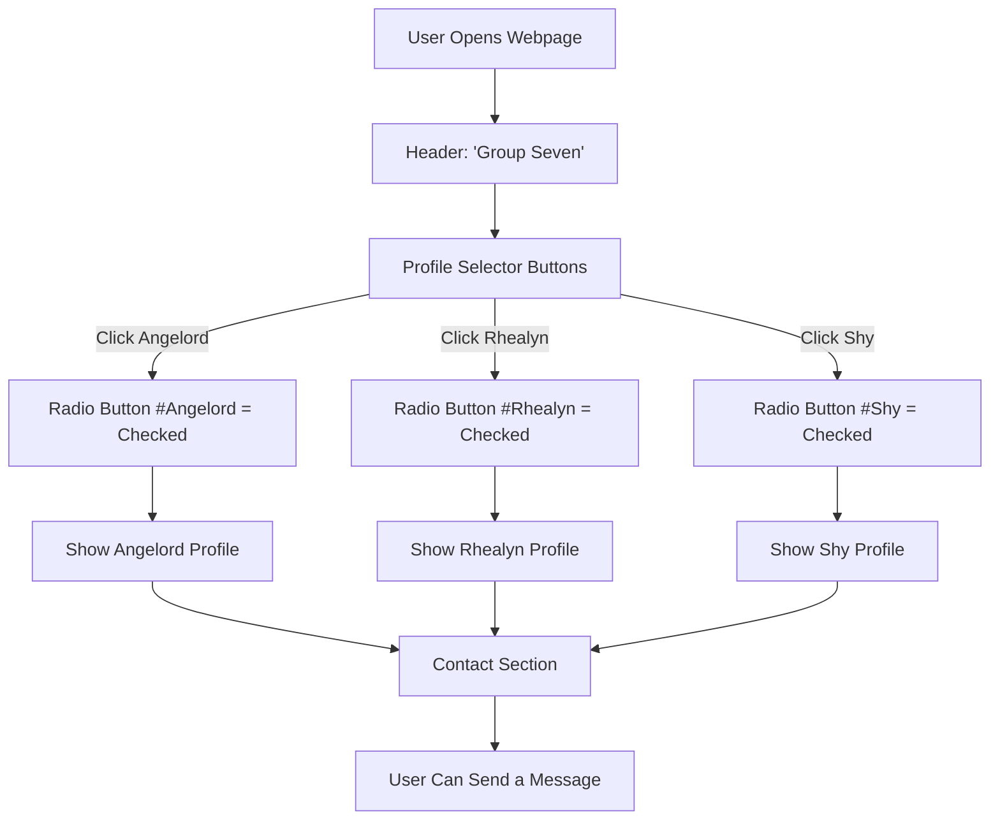

```mermaid 
flowchart TD 
A[User Opens Webpage] --> B[Header: 'Group Seven'] 
B --> C[Profile Selector Buttons] 
C -->|Click Angelord| D[Radio Button #Angelord = Checked] 
C -->|Click Rhealyn| E[Radio Button #Rhealyn = Checked] 
C -->|Click Shy| F[Radio Button #Shy = Checked] 
D --> G[Show Angelord Profile] 
E --> H[Show Rhealyn Profile] 
F --> I[Show Shy Profile] 
G --> J[Contact Section] 
H --> J
I --> J

J --> K[User Can Send a Message]
```
